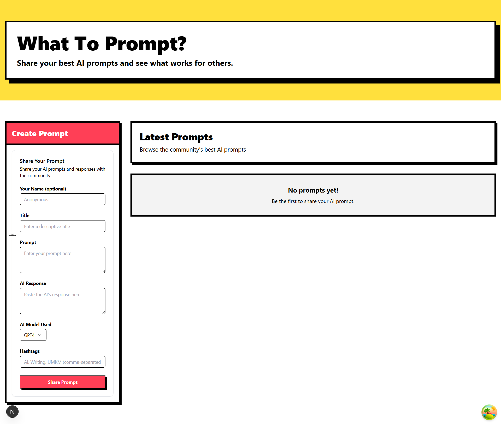

# Make or Die: WhatToPrompt?

This project is (almost) fully vibe coded with AI 🤖

(Help me better? 🥺)

## What is this?

WhatToPrompt is a platform for sharing and discovering AI prompts. Share your prompts, the AI's response, and the model used. Use hashtags for easy discovery (e.g., #UMKM).

## Quick Start

1.  `git clone <repository-url>`
2.  `npm install`
3.  `npm run dev`

Open [http://localhost:3000](http://localhost:3000).

## Design: Neobrutalism

We're building with a **Neobrutalist** vibe. Think:

- Strong black borders
- Solid, contrasting colors
- Bold, clear typography
- Distinct, hard-edged shadows

_Keep it functional and minimalist._

## Tech Stack Highlights

- **Framework**: Next.js
- **UI**: shadcn/ui + Tailwind CSS
- **Forms**: React Hook Form + Zod
- **Data**: TanStack Query
- **Code Quality**: ESLint, Prettier, Husky (auto-formats/lints on commit)

## Contributors

- [suryaelidanto](https://github.com/suryaelidanto)
- Add your name here, just add it (don't be lazy) 🐺
